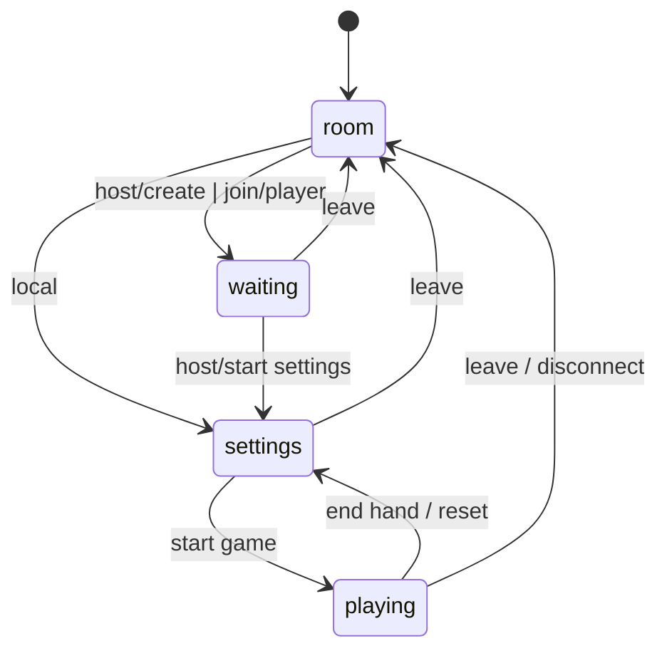

# UI State Flow (Minimal)

## Mermaid

## Notes
- uiState is the single source of screen visibility.
- Any transition should go through setUiState().
- Non-host flows should not jump to settings or playing without a host action.
